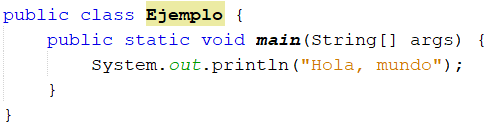

# Bienvenido al Curso de Programación en Java

## Contenidos
- Fundamentos de programación
    -   Variables
    -   Estructiras de Control
    -   Manejo de excepciones
    -   jShell
    -   Funciones/Métodos

- Programación Orientada a Ojetos
    - Arreglos
    - Clases
    - Privacidad
    - Herencia
    - Polimorfismo
    - Interfaces
- Manejo de Archivos
- Hilos
- etc...

